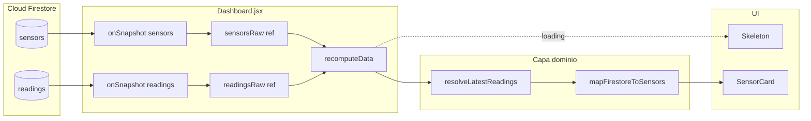
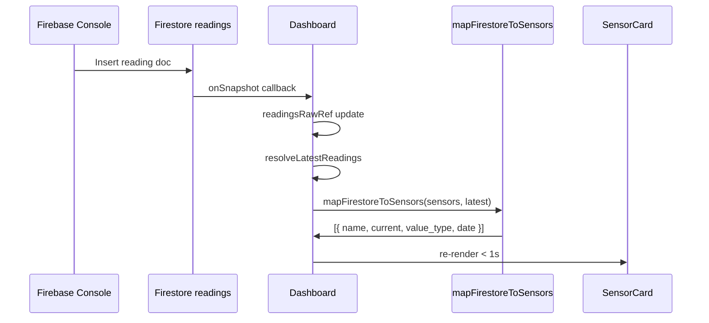

# Diseño — Issue #12: Firestore Realtime + JOIN sensors/readings

| Campo | Valor |
|---|---|
| **Issue** | [#12](https://github.com/iesgermansanchezruiperez/webapp-demeteria/issues/12) |
| **Feature** | `003-firestore-realtime` |
| **Fase SDD** | 2 — Diseño arquitectónico |
| **Entrada** | [`spec.md`](spec.md), [`.cursorrules`](../../.cursorrules) |
| **Contratos** | [`contracts/mapper-join.md`](contracts/mapper-join.md), [`contracts/firebase-service.md`](contracts/firebase-service.md) |

## 1. Objetivo del diseño

Conectar el dashboard a **Cloud Firestore** con dos colecciones (`sensors`, `readings`), resolver en cliente la **última lectura por sensor** y transformar el resultado en props planas `{ name, current, value_type, date }` consumibles por `SensorCard` sin modificar su contrato.

El núcleo del diseño es el **JOIN en el mapper** (FR-004 + FR-006): la UI nunca ve documentos Firestore crudos.

### 1.1 Estado actual vs. objetivo

| Aspecto | Estado actual (RTDB legacy) | Objetivo |
|---|---|---|
| Cliente Firebase | `getDatabase` + `onValue('/demeteria')` | `getFirestore` + `onSnapshot` × 2 |
| Mapper | `mapFirebaseToSensors(demeteriaNode)` | `mapFirestoreToSensors(sensorsList, latestReadings)` |
| Clave de cruce | Rutas anidadas hardcodeadas | `sensors.id` ↔ `readings.sensorId` |
| Metadatos (name, unit) | Hardcodeados en mapper | Desde colección `sensors` |
| Lecturas | Embebidas en árbol | Colección `readings` + reducción por `timestamp` |

---

## 2. Principios arquitectónicos

1. **JOIN en mapper, no en UI** — `Dashboard.jsx` orquesta snapshots; `mapFirestoreToSensors` concentra cruce y transformación (FR-004, FR-006, FR-013).
2. **Recomputación reactiva** — Cualquier cambio en `sensors` o `readings` dispara `resolveLatestReadings` + mapper (FR-010).
3. **Contrato UI inmutable** — `SensorCard` sigue recibiendo `{ name, current, value_type, date }`; strings en `current` y `date` (FR-005).
4. **Filtrado explícito** — Solo `active: true` con lectura emparejada aparece en el grid (SC-006).
5. **Sin queries compuestas** — Escucha colección completa `readings`; reducción O(n) en cliente (research R2).

---

## 3. Diagrama de flujo de datos



---

## 4. Diseño del JOIN (FR-004 + FR-006)

### 4.1 FR-004 — Cruce por ID y última lectura

**Claves de cruce**:
- Lado catálogo: `sensors[].id` (string, ej. `"sensor_humedad_01"`)
- Lado lecturas: `readings[].sensorId` (string, mismo valor)

**Algoritmo `resolveLatestReadings(readingsList)`**:

```js
function resolveLatestReadings(readingsList) {
  const latestBySensorId = new Map()

  for (const reading of readingsList ?? []) {
    if (!reading?.sensorId) continue

    const prev = latestBySensorId.get(reading.sensorId)
    if (!prev || reading.timestamp > prev.timestamp) {
      latestBySensorId.set(reading.sensorId, reading)
    }
  }

  return latestBySensorId
}
```

**Reglas**:
- Empate o lectura única: se conserva el documento con mayor `timestamp`.
- `sensorId` huérfano (sin sensor en catálogo): ignorado en paso 2 del mapper.
- Sensor activo sin entrada en `latestBySensorId`: omitido (no inventar `current`).

### 4.2 FR-006 — Transformación de campos

Por cada par `(sensor, reading)` emparejado:

```js
function toFlatSensor(sensor, reading) {
  const date = new Date(reading.timestamp)
  if (Number.isNaN(date.getTime())) return null

  return {
    name: sensor.name,                        // sensors.name → name
    value_type: sensor.unit,                  // sensors.unit → value_type
    current: String(reading.value),           // readings.value → current
    date: date.toISOString(),                 // readings.timestamp → date
  }
}
```

**Tabla de mapeo estricto**:

| Origen | Campo Firestore | Destino | Transformación |
|--------|-----------------|---------|----------------|
| Catálogo | `sensors.name` | `name` | Copia directa |
| Catálogo | `sensors.unit` | `value_type` | Copia directa |
| Lectura | `readings.value` | `current` | `String(value)` |
| Lectura | `readings.timestamp` | `date` | `new Date(ms).toISOString()` |

**Campos Firestore que NO salen del mapper** (FR-007): `sensorId`, `value`, `unit`, `timestamp`, `id`, `active`, `type`, `description`, etc.

### 4.3 Función completa `mapFirestoreToSensors`

```js
export function mapFirestoreToSensors(sensorsList, latestReadings) {
  const latestMap =
    latestReadings instanceof Map
      ? latestReadings
      : resolveLatestReadings(latestReadings)

  const result = []

  for (const sensor of sensorsList ?? []) {
    if (sensor?.active !== true) continue
    if (!sensor?.id) continue

    const reading = latestMap.get(sensor.id)
    if (!reading) continue

    const flat = toFlatSensor(sensor, reading)
    if (flat) result.push(flat)
  }

  return result
}
```

**Orden de salida**: orden de iteración de `sensorsList` (estable, predecible para keys React).

---

## 5. Diseño de `Dashboard.jsx` (reactividad)

### 5.1 Estados (FR-009)

```js
const [data, setData] = useState([])
const [loading, setLoading] = useState(true)
const [error, setError] = useState(null)
```

### 5.2 Refs para snapshots crudos

```js
const sensorsRawRef = useRef([])
const readingsRawRef = useRef([])
const sensorsReadyRef = useRef(false)
const readingsReadyRef = useRef(false)
```

### 5.3 Recomputación central (FR-010)

```js
function recomputeData() {
  const latest = resolveLatestReadings(readingsRawRef.current)
  setData(mapFirestoreToSensors(sensorsRawRef.current, latest))
  if (sensorsReadyRef.current && readingsReadyRef.current) {
    setLoading(false)
  }
}
```

### 5.4 Dual listener (FR-008)

```js
useEffect(() => {
  const unsubSensors = onSnapshot(
    collection(db, 'sensors'),
    (snap) => {
      sensorsRawRef.current = snap.docs.map((d) => ({ id: d.id, ...d.data() }))
      sensorsReadyRef.current = true
      recomputeData()
      setError(null)
    },
    (err) => { setError(err.message); setLoading(false) }
  )

  const unsubReadings = onSnapshot(
    collection(db, 'readings'),
    (snap) => {
      readingsRawRef.current = snap.docs.map((d) => d.data())
      readingsReadyRef.current = true
      recomputeData()
      setError(null)
    },
    (err) => { setError(err.message); setLoading(false) }
  )

  return () => { unsubSensors(); unsubReadings() }
}, [])
```

**Nota**: Si el documento Firestore ya incluye campo `id` en data, preferir `d.data().id ?? d.id` para FR-004.

### 5.5 Render

| Condición | UI |
|-----------|-----|
| `loading === true` | Grid de `SensorSkeleton` (Tailwind) |
| `error !== null` | Banner accesible `role="alert"` |
| `data.length > 0` | `data.map(s => <SensorCard key={s.name} sensor={s} />)` |
| `data.length === 0` && !loading | Grid vacío (sin crash) |

Skeleton count: `Math.max(sensorsRawRef.current.filter(s => s.active).length, 3)` tras primer snapshot de sensors, o 5 por defecto inicial.

---

## 6. Árbol de archivos

```text
src/
├── services/
│   └── firebase.js              # MODIFY — getFirestore, export db
├── mappers/
│   ├── mapFirestoreToSensors.js # NEW — JOIN + FR-006
│   └── mapFirebaseToSensors.js  # DELETE — obsoleto
├── components/
│   ├── Dashboard.jsx            # MODIFY — dual onSnapshot, data state
│   ├── SensorCard.jsx           # NO CHANGE
│   └── SensorSkeleton.jsx       # NO CHANGE
└── mocks/
    └── sensorData.json          # MODIFY — { sensors[], readings[] }
```

---

## 7. Secuencia temporal (tiempo real)



---

## 8. Decisiones fuera de alcance

- Queries Firestore con `orderBy` + `limit(1)` por sensor.
- Autenticación / reglas de seguridad.
- Históricos y gráficas.
- Cambios en contrato `SensorCard`.
