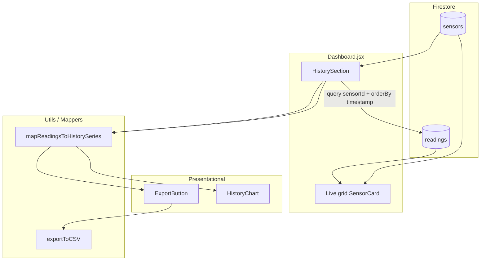

# Diseño — Issue #11: Gráficos Históricos y Exportación CSV

| Campo | Valor |
|---|---|
| **Issue** | [#11](https://github.com/iesgermansanchezruiperez/webapp-demeteria/issues/11) |
| **Feature** | `004-history-chart-csv` |
| **Entrada** | [spec.md](spec.md), [research.md](research.md) |

## 1. Objetivo

Añadir sección de histórico bajo el grid en vivo: gráfico Tremor `LineChart`, export CSV, query Firestore por sensor. Componentes de presentación puros; fetching en contenedor.

## 2. Arquitectura



## 3. Árbol de archivos

```text
src/
├── components/
│   ├── Dashboard.jsx           # MODIFY — render HistorySection below grid
│   ├── HistorySection.jsx      # NEW — selector, query, state
│   ├── HistoryChart.jsx        # NEW — Tremor LineChart pure
│   ├── ExportButton.jsx        # NEW — atomic button
│   ├── SensorCard.jsx          # NO CHANGE
│   └── SensorSkeleton.jsx      # NO CHANGE
├── mappers/
│   ├── mapFirestoreToSensors.js    # NO CHANGE (export toTimestampMs)
│   └── mapReadingsToHistorySeries.js  # NEW
├── utils/
│   └── export.js               # NEW — exportToCSV
└── mocks/
    └── firestoreData.json      # NEW — histórico extenso
```

## 4. HistorySection (contenedor)

### Responsabilidades

- Recibir `sensors[]` desde Dashboard (catálogo ya cargado) o cargar propia lista
- `<select>` para `selectedSensorId`
- `useEffect` + query Firestore filtrada
- Pasar `series` a `HistoryChart` y `ExportButton`

### Integración en Dashboard

```jsx
{!loading && (
  <HistorySection sensors={sensorsRawRef...} />
)}
```

Preferible: exponer `sensors` desde state Dashboard (`sensorsCatalog`) para evitar refs en JSX.

## 5. HistoryChart (puro)

```jsx
export default function HistoryChart({ series, title, emptyMessage }) {
  if (!series?.length) {
    return <p className="text-slate-500">{emptyMessage ?? 'Sin datos históricos'}</p>
  }
  return (
    <Card className="bg-white/80 backdrop-blur-md ...">
      <h2>{title}</h2>
      <LineChart data={series} index="date" categories={['value']} colors={['emerald']} />
    </Card>
  )
}
```

## 6. ExportButton + exportToCSV

```jsx
<ExportButton
  disabled={!series.length}
  onExport={() => exportToCSV(series, `demeteria-${selectedSensorId}.csv`)}
/>
```

Botón Tailwind:
`transition-all duration-300 hover:shadow-md hover:-translate-y-0.5`

## 7. Mock-first workflow

1. Crear `firestoreData.json` con ≥ 10 readings para `sensor_humedad_01`
2. Implementar `mapReadingsToHistorySeries` — validar offline
3. Implementar `HistoryChart` + `exportToCSV` con mock
4. Conectar `HistorySection` query Firestore

## 8. Fuera de alcance

- Multi-sensor en un chart
- Netlify config
- Paginación / limit query
