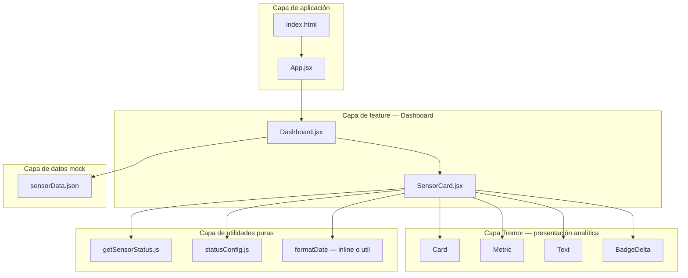
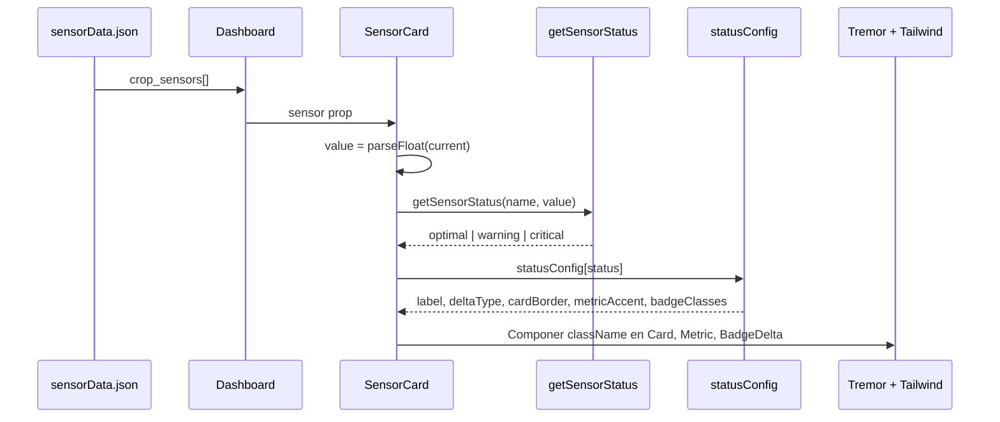

# Diseño — Issue #9: UI del Dashboard y Accesibilidad Pronisa

| Campo | Valor |
|---|---|
| **Issue** | [#9](https://github.com/iesgermansanchezruiperez/webapp-demeteria/issues/9) |
| **Fase SDD** | 2 — Diseño arquitectónico |
| **Entrada** | [`requirements.md`](requirements.md), [`.cursorrules`](../../.cursorrules) |
| **Salida esperada (Fase 3)** | Implementación JSX sin nuevas dependencias |

## 1. Objetivo del diseño

Definir la arquitectura frontend que cumple los requisitos EARS aprobados en Fase 1, refactorizando el MVP monolítico actual (`Dashboard.jsx` con lógica inline) hacia una estructura modular de componentes atómicos y utilidades puras, manteniendo Tremor como capa de presentación analítica y Tailwind como única fuente de estilos.

### 1.1 Estado actual vs. objetivo

| Aspecto | Estado actual | Objetivo de diseño |
|---|---|---|
| Estructura | `SensorCard` y `getSensorStatus` embebidos en `Dashboard.jsx` | Separación en utils + componentes atómicos |
| Colores por estado | Solo `BadgeDelta` (sin borde ni acento métrico) | Propagación coherente a 3 superficies (REQ-C-001) |
| Etiquetas de estado | Inglés (`Optimal`, `Warning`, `Critical`) | Español (`Óptimo`, `Advertencia`, `Crítico`) |
| Layout | `gap-4`, `sm:grid-cols-2`, `max-w-xs` en tarjetas | Bento Grid `md:grid-cols-3`, `gap-6`, sin `max-w-xs` |
| Contenedor raíz | `bg-gray-100` plano | Gradiente Premium Agrotech |
| A11y | Sin semántica HTML ni `aria-*` | `<article>`, jerarquía de encabezados, `aria-label` |
| Contraste | Clases Tremor por defecto (`text-tremor-content-subtle`) | Paleta fija ≥ 4.5:1 documentada en sección 4 |

---

## 2. Principios arquitectónicos

1. **Separación de responsabilidades:** la lógica de negocio (umbrales) y el mapeo visual (clases Tailwind) viven en módulos utilitarios puros; los componentes React solo orquestan datos y composición.
2. **Single source of truth del estado:** `getSensorStatus()` es la única función que determina `optimal | warning | critical`. Ningún componente recalcula umbrales.
3. **Configuración declarativa:** `statusConfig.js` centraliza etiquetas ES, `deltaType` de Tremor y tokens Tailwind por estado. Evita condicionales dispersos en JSX.
4. **Composición sobre herencia:** Tremor provee estructura analítica (`Card`, `Metric`, `BadgeDelta`); Tailwind sobrescribe apariencia sin CSS custom.
5. **Accesibilidad por capas:** HTML semántico nativo primero; atributos ARIA como refuerzo, no sustituto.
6. **Cero dependencias nuevas:** sin state managers, sin librerías A11y adicionales, sin charts.

---

## 3. Árbol de componentes React

### 3.1 Diagrama de composición



### 3.2 Árbol de archivos propuesto

```
src/
├── App.jsx                          # Shell: fondo gradiente + contenedor max-width
├── index.css                        # Base: antialiased + focus-visible global
├── components/
│   ├── Dashboard.jsx                # Orquestador: header + grid Bento + map de sensores
│   └── SensorCard.jsx               # Tarjeta atómica: un sensor, estado visual completo
├── utils/
│   ├── getSensorStatus.js           # Lógica pura: nombre + valor → estado
│   └── statusConfig.js              # Mapa declarativo: estado → UI (labels, deltaType, clases)
└── mocks/
    └── sensorData.json              # Sin cambios (Out of scope)

index.html                           # lang="es", título descriptivo
```

### 3.3 Responsabilidades por componente

#### `App.jsx` (shell)

| Responsabilidad | Detalle |
|---|---|
| Contenedor raíz | `<main>` con gradiente Premium Agrotech y padding responsivo |
| Centrado de contenido | Wrapper `max-w-7xl mx-auto` opcional |
| **No hace** | Lógica de sensores, importación de mock, estilos por estado |

#### `Dashboard.jsx` (feature container)

| Responsabilidad | Detalle |
|---|---|
| Importar mock | `sensorData.crop_sensors` |
| Cabecera semántica | `<header>` con marca, `<h1>` único, subtítulo descriptivo |
| Grid Bento | `grid grid-cols-1 md:grid-cols-3 gap-6` |
| Composición | Mapea cada sensor a `<SensorCard key={sensor.name} sensor={sensor} />` |
| **No hace** | Cálculo de umbrales, clases por estado, renderizado Tremor interno |

#### `SensorCard.jsx` (componente atómico)

| Responsabilidad | Detalle |
|---|---|
| Recibir prop | `sensor` (objeto del mock RTDB) |
| Derivar estado | `parseFloat(sensor.current)` → `getSensorStatus(sensor.name, value)` |
| Resolver UI | Consultar `statusConfig[status]` para clases, label y `deltaType` |
| Renderizar Tremor | `Card`, `Text`, `Metric`, `BadgeDelta` con clases Tailwind aplicadas |
| Semántica A11y | `<article>`, `<h2>`, `<time datetime>`, `aria-labelledby`, `aria-describedby`, `aria-label` |
| **No hace** | Importar JSON directamente, definir umbrales inline |

#### `getSensorStatus.js` (utilidad pura)

| Responsabilidad | Detalle |
|---|---|
| Entrada | `(name: string, value: number)` |
| Salida | `'optimal' \| 'warning' \| 'critical'` |
| Detección de tipo | `name.toLowerCase().includes('temperatura' \| 'humedad' \| 'ph')` |
| Umbrales | Según sección 2 de `requirements.md` |
| Fallback | Sensor desconocido → `'warning'` (REQ-UW-001) |
| **No hace** | JSX, imports de React, clases CSS |

#### `statusConfig.js` (mapa declarativo)

| Responsabilidad | Detalle |
|---|---|
| Exportar objeto | Clave por estado (`optimal`, `warning`, `critical`) |
| Por cada estado | `label` (ES), `deltaType` (Tremor), `cardBorder`, `metricAccent`, `badgeClasses` |
| **No hace** | Lógica condicional, renderizado |

---

## 4. Mapeo de clases Tailwind CSS

### 4.1 Filosofía de la paleta

Todas las combinaciones texto/fondo se seleccionan para superar **4.5:1** (WCAG AA, texto normal). Se evitan tonos `-400` o inferiores para texto legible. El glassmorphism usa fondos semitransparentes, pero el texto siempre se apoya en tonos `-600` a `-900` de slate/emerald/amber/rose sobre blanco o pastels `-100`.

> **Nota de verificación:** en Fase 3, validar con inspección manual o herramienta de contraste del navegador antes del despliegue (REQ-UW-003). No se añaden herramientas automatizadas (Out of scope).

### 4.2 Capa shell — `App.jsx`

| Elemento | Clases Tailwind | Contraste objetivo |
|---|---|---|
| `<main>` | `min-h-screen bg-gradient-to-br from-slate-50 to-emerald-50/30 p-6 md:p-10` | Fondo decorativo (sin texto) |
| Contenedor interior | `max-w-7xl mx-auto` | — |

### 4.3 Capa cabecera — `Dashboard.jsx`

El header **no usa Tremor** (`Text`/`Metric`). HTML semántico + Tailwind ofrece mejor control de contraste y jerarquía tipográfica (REQ-U-012, decisión de diseño).

| Elemento | Clases Tailwind | Ratio estimado |
|---|---|---|
| Marca (`<p>`) | `text-slate-600 text-sm font-medium uppercase tracking-wide` | ~5.7:1 sobre gradiente claro |
| Título (`<h1>`) | `text-slate-900 text-3xl font-semibold tracking-tight` | ~15:1 sobre gradiente claro |
| Subtítulo (`<p>`) | `text-slate-600 mt-2` | ~5.7:1 sobre gradiente claro |
| Sección | `aria-labelledby="dashboard-title"` en `<section>` | — |
| Header wrapper | `mb-8` | — |
| Grid de tarjetas | `grid grid-cols-1 md:grid-cols-3 gap-6` | — |

### 4.4 Capa tarjeta — base glassmorphism (independiente del estado)

Clases aplicadas al componente Tremor `Card` en **todos** los estados:

| Token | Clases Tailwind | Propósito |
|---|---|---|
| Fondo vidrio | `bg-white/80 backdrop-blur-md` | Glassmorphism (REQ-U-011) |
| Borde base | `border border-white/50` | Borde sutil de cristal |
| Forma | `rounded-2xl` | Esquinas premium |
| Sombra | `shadow-sm` | Elevación ligera |
| Microinteracción | `transition-all duration-300 hover:shadow-md hover:-translate-y-0.5` | Feedback orgánico |
| Layout interno | Sin `max-w-xs` (tarjeta ocupa celda del grid) | Bento uniforme |

### 4.5 Capa tarjeta — tokens semánticos por estado

El borde semántico **sustituye** el borde neutro `border-white/50` mediante concatenación de clases desde `statusConfig`:

| Estado | Borde tarjeta (`cardBorder`) | Acento métrica (`metricAccent`) | Badge (`badgeClasses`) | `deltaType` |
|---|---|---|---|---|
| `optimal` | `border-emerald-200` | `text-emerald-700` | `text-emerald-900 bg-emerald-100 ring-1 ring-emerald-300` | `moderateIncrease` |
| `warning` | `border-amber-300` | `text-amber-800` | `text-amber-900 bg-amber-100 ring-1 ring-amber-400` | `unchanged` |
| `critical` | `border-rose-300` | `text-rose-800` | `text-rose-900 bg-rose-100 ring-1 ring-rose-400` | `decrease` |

### 4.6 Capa contenido interno — `SensorCard.jsx`

| Elemento | Clases Tailwind | Ratio estimado |
|---|---|---|
| Nombre sensor (`<h2>` vía Tremor `Text`) | `text-slate-900 font-medium tracking-tight` | ~15:1 sobre `bg-white/80` |
| Valor métrico (`Metric`) | `text-slate-900 tracking-tight` + `metricAccent` del estado | ≥ 4.5:1 (acento semántico oscuro) |
| Fecha (`<time>` vía Tremor `Text`) | `text-slate-600 text-sm` | ~5.7:1 sobre `bg-white/80` |
| Footer layout | `mt-4 flex items-center justify-between gap-4` | — |

### 4.7 Capa global — `index.css`

| Regla | Clases / directiva | Propósito |
|---|---|---|
| Suavizado de fuentes | `@layer base { html { @apply antialiased; } }` | Tipografía pulida |
| Foco visible | `*:focus-visible { @apply outline-none ring-2 ring-emerald-600 ring-offset-2; }` | REQ-O-003, teclado |

### 4.8 Capa documento — `index.html`

| Atributo | Valor | Propósito |
|---|---|---|
| `lang` | `es` | Lectores de pantalla en español |
| `<title>` | `DemeterIA — Dashboard de Sensores` | Identificación de página |

### 4.9 Tabla resumen de contraste (trazabilidad REQ-U-008)

| Superficie | Texto | Fondo efectivo | Cumple 4.5:1 |
|---|---|---|---|
| Cabecera | `text-slate-900` | `slate-50` (gradiente) | Sí |
| Cabecera secundaria | `text-slate-600` | `slate-50` (gradiente) | Sí |
| Nombre sensor | `text-slate-900` | `white/80` | Sí |
| Valor métrica (neutro) | `text-slate-900` | `white/80` | Sí |
| Valor métrica (acento optimal) | `text-emerald-700` | `white/80` | Sí (~5.5:1) |
| Valor métrica (acento warning) | `text-amber-800` | `white/80` | Sí (~5.9:1) |
| Valor métrica (acento critical) | `text-rose-800` | `white/80` | Sí (~6.2:1) |
| Fecha | `text-slate-600` | `white/80` | Sí |
| Badge optimal | `text-emerald-900` | `emerald-100` | Sí (~8:1) |
| Badge warning | `text-amber-900` | `amber-100` | Sí (~7:1) |
| Badge critical | `text-rose-900` | `rose-100` | Sí (~7.5:1) |

---

## 5. Estrategia de renderizado condicional por estado

### 5.1 Flujo de datos (unidireccional)



### 5.2 Patrón arquitectónico: «Compute once, configure declaratively»

1. **Compute once:** en el render de `SensorCard`, calcular `value` y `status` una sola vez al inicio del cuerpo del componente.
2. **Lookup:** obtener `config = statusConfig[status]`. Si `status` es inválido (no debería ocurrir), fallback a `statusConfig.warning`.
3. **Propagate:** aplicar `config` a exactamente **tres superficies visuales** (REQ-E-003, REQ-C-001):
   - **Superficie A — Borde de tarjeta:** `Card` recibe `className` = clases base glassmorphism + `config.cardBorder`.
   - **Superficie B — Acento métrico:** `Metric` recibe `className` = clases tipográficas base + `config.metricAccent`.
   - **Superficie C — Badge de estado:** `BadgeDelta` recibe `deltaType={config.deltaType}`, texto `config.label`, y `className={config.badgeClasses}`.

### 5.3 Reglas de composición de `className`

| Regla | Descripción |
|---|---|
| **Base + semántico** | Las clases base (glassmorphism, tipografía) son constantes; las semánticas se concatenan desde `statusConfig`. Nunca se mezclan clases de distintos estados. |
| **Sin lógica en JSX** | Prohibido `status === 'optimal' ? 'text-emerald-700' : ...` en el componente. Todo condicional vive en el lookup del mapa. |
| **Coherencia garantizada** | Al derivar las tres superficies del mismo `config`, es imposible tener borde `emerald` con badge `rose`. |
| **Tremor como vessel** | `BadgeDelta` aporta iconografía direccional vía `deltaType`; Tailwind refuerza color y contraste encima. |

### 5.4 Estructura declarativa de `statusConfig.js`

Cada entrada del mapa contiene:

| Campo | Tipo | Consumidor |
|---|---|---|
| `label` | `string` | Texto visible del `BadgeDelta` (ES) |
| `deltaType` | `'moderateIncrease' \| 'unchanged' \| 'decrease'` | Prop de Tremor `BadgeDelta` |
| `cardBorder` | `string` (clases Tailwind) | `Card.className` |
| `metricAccent` | `string` (clases Tailwind) | `Metric.className` |
| `badgeClasses` | `string` (clases Tailwind) | `BadgeDelta.className` |

### 5.5 Manejo de casos límite (REQ-UW-001, REQ-UW-002)

| Condición | Comportamiento de diseño |
|---|---|
| `parseFloat(current)` → `NaN` | `getSensorStatus` recibe `NaN`; la función trata cualquier comparación numérica como falsa y cae en `critical` o se añade guard clause explícita que retorna `'warning'` antes de evaluar umbrales |
| Sensor desconocido | `getSensorStatus` retorna `'warning'` → UI ámbar coherente en las 3 superficies |
| Valor en límite exacto (ej. 18.0°C) | Inclusivo en rango `optimal` (`18 ≤ value ≤ 30`) |

> **Decisión de diseño:** se recomienda guard clause al inicio de `getSensorStatus`: si `Number.isNaN(value)`, retornar `'warning'` inmediatamente. Documentado aquí para trazabilidad con REQ-UW-002.

### 5.6 Por qué no Context API ni estado global

El dashboard es **read-only** con datos mock estáticos. No hay mutación de sensores ni polling. Cada `SensorCard` deriva su estado localmente desde props. Esto elimina complejidad innecesaria y cumple el enfoque minimalista de `.cursorrules`.

---

## 6. Estrategia de accesibilidad (A11y)

### 6.1 Jerarquía de encabezados

| Nivel | Contenido | Ubicación |
|---|---|---|
| `<h1>` | «Dashboard de Sensores» | `Dashboard.jsx` — único en la página |
| `<h2>` | Nombre del sensor (ej. «Sensor de temperatura») | `SensorCard.jsx` — uno por tarjeta |

### 6.2 Estructura semántica por tarjeta

| Elemento HTML | Rol | Atributos |
|---|---|---|
| `<article>` | Contenedor independiente de cada sensor | `aria-labelledby={id-titulo}`, `aria-describedby={id-descripcion}` |
| `<h2>` | Título del sensor | `id={id-titulo}` |
| `Metric` / valor | Dato principal | `aria-label="Valor actual: {current} {unidad}"` |
| `<time>` | Timestamp de lectura | `dateTime={sensor.date}` — ISO 8601 |
| `BadgeDelta` | Indicador de estado | `aria-label="Estado: {label español}"` |

### 6.3 IDs generados

Patrón: `sensor-{slug}-{suffix}` donde `slug` deriva del nombre normalizado (ej. `sensor-temperatura-title`, `sensor-temperatura-desc`).

---

## 7. Trazabilidad requisitos → diseño

| Requisito | Decisión de diseño |
|---|---|
| REQ-U-001..004 | `Dashboard` + `SensorCard` + Tremor |
| REQ-U-005 | `getSensorStatus.js` |
| REQ-U-006..007, REQ-S-001..003 | `statusConfig.js` + propagación 3 superficies |
| REQ-U-008, REQ-UW-003 | Sección 4 — paleta verificada |
| REQ-U-009 | `statusConfig.label` en español |
| REQ-U-010 | Grid `md:grid-cols-3 gap-6` |
| REQ-U-011 | Glassmorphism + gradiente + hover |
| REQ-U-012 | Utils `.js` + componentes `.jsx` atómicos |
| REQ-E-001..004 | Flujo sección 5.1 |
| REQ-C-001 | Patrón «Compute once, configure declaratively» |
| REQ-O-001..003 | Sección 6 |
| REQ-UW-001..002 | Sección 5.5 |

---

## 8. Plan de implementación (Fase 3 — referencia)

Orden sugerido para minimizar regresiones:

1. Crear `src/utils/getSensorStatus.js` y `src/utils/statusConfig.js`
2. Extraer `SensorCard.jsx` desde `Dashboard.jsx`
3. Refactorizar `Dashboard.jsx` (header semántico + grid)
4. Actualizar `App.jsx`, `index.css`, `index.html`
5. Verificar `npm run build && npm run lint` + revisión visual de contraste

---

## 9. Out of scope (heredado de requirements.md)

Sin cambios respecto a Fase 1. Este diseño no contempla Firebase RTDB, tests automatizados, nuevas dependencias, gráficas históricas ni configuración dinámica de umbrales.

---

## 10. Criterios de aprobación de este diseño

- [ ] El árbol de componentes cubre todos los archivos necesarios sin módulos superfluos
- [ ] El mapeo Tailwind garantiza glassmorphism y contraste ≥ 4.5:1 en cada superficie legible
- [ ] La estrategia de colores condicionales es coherente en borde, métrica y badge
- [ ] La trazabilidad a `requirements.md` es completa
- [ ] Diseño aprobado para pasar a Fase 3 (implementación)
