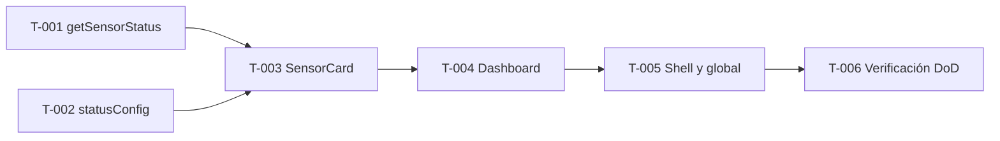

# Tareas — Issue #9: UI del Dashboard y Accesibilidad Pronisa

| Campo | Valor |
|---|---|
| **Issue** | [#9](https://github.com/iesgermansanchezruiperez/webapp-demeteria/issues/9) |
| **Fase SDD** | 3 — Plan de implementación |
| **Entrada** | [`requirements.md`](requirements.md), [`design.md`](design.md) |
| **Estimación total** | 8–12 horas (6 tareas) |

## Convenciones

- **ID:** identificador único de tarea (`T-00X`).
- **Dependencias:** tareas que deben estar completadas antes de iniciar la actual.
- **Estimación:** tiempo máximo de trabajo enfocado por tarea (≤ 3 h).
- **Verification criteria:** condiciones objetivas de cierre; todas deben marcarse para dar la tarea por terminada.

## Grafo de dependencias

> `T-001` y `T-002` son independientes entre sí y pueden ejecutarse en paralelo.

---

## T-001 — Crear utilidad de evaluación de umbrales

| Campo | Valor |
|---|---|
| **Estimación** | 1 h |
| **Dependencias** | Ninguna |
| **Requisitos** | REQ-U-005, REQ-UW-001, REQ-UW-002 |

### Archivos

| Acción | Ruta |
|---|---|
| Crear | `src/utils/getSensorStatus.js` |

### Descripción

Extraer la lógica de umbrales que hoy vive inline en `Dashboard.jsx` hacia una función pura exportada. La función recibe `(name, value)` y retorna `'optimal' | 'warning' | 'critical'` según la sección 2 de `requirements.md`. Incluir guard clause para `Number.isNaN(value)` → `'warning'`. Sensor desconocido → `'warning'`.

### Verification criteria

- [ ] El archivo exporta una única función `getSensorStatus` sin imports de React ni JSX
- [ ] Temperatura: `26.10` → `optimal`; `16` → `warning`; `10` → `critical`; `36` → `critical`
- [ ] Humedad: `50` → `optimal`; `35` → `warning`; `25` → `critical`; `85` → `critical`
- [ ] pH: `6.10` → `optimal`; `5.2` → `warning`; `4.5` → `critical`; `7.3` → `warning`
- [ ] Límite inclusivo: `18.0` (temperatura) → `optimal`; `30.0` → `optimal`
- [ ] `getSensorStatus('Sensor desconocido', 50)` → `warning`
- [ ] `getSensorStatus('Sensor de temperatura', NaN)` → `warning`

---

## T-002 — Crear mapa declarativo de configuración visual por estado

| Campo | Valor |
|---|---|
| **Estimación** | 1 h |
| **Dependencias** | Ninguna |
| **Requisitos** | REQ-U-006, REQ-U-009, REQ-S-001, REQ-S-002, REQ-S-003 |

### Archivos

| Acción | Ruta |
|---|---|
| Crear | `src/utils/statusConfig.js` |

### Descripción

Crear el objeto exportado que mapea cada estado (`optimal`, `warning`, `critical`) a su configuración UI: `label` (español), `deltaType` (Tremor), `cardBorder`, `metricAccent`, `badgeClasses`. Los valores de clases deben coincidir exactamente con la sección 4.5 de `design.md`. Sin lógica condicional ni imports de React.

### Verification criteria

- [ ] El archivo exporta un objeto con claves `optimal`, `warning` y `critical`
- [ ] Cada entrada contiene los campos: `label`, `deltaType`, `cardBorder`, `metricAccent`, `badgeClasses`
- [ ] Labels en español: `Óptimo`, `Advertencia`, `Crítico`
- [ ] `deltaType` por estado: `moderateIncrease`, `unchanged`, `decrease`
- [ ] `cardBorder` usa tonos `emerald-200`, `amber-300`, `rose-300` respectivamente
- [ ] `metricAccent` usa `text-emerald-700`, `text-amber-800`, `text-rose-800`
- [ ] `badgeClasses` incluye pares texto/fondo de alto contraste (`*-900` sobre `*-100`) con `ring-1`

---

## T-003 — Crear componente atómico SensorCard

| Campo | Valor |
|---|---|
| **Estimación** | 2–3 h |
| **Dependencias** | T-001, T-002 |
| **Requisitos** | REQ-U-003, REQ-U-004, REQ-U-006, REQ-U-007, REQ-U-011, REQ-E-002, REQ-E-003, REQ-E-004, REQ-C-001, REQ-O-001, REQ-O-002 |

### Archivos

| Acción | Ruta |
|---|---|
| Crear | `src/components/SensorCard.jsx` |

### Descripción

Implementar el componente atómico que recibe la prop `sensor`, deriva estado vía `getSensorStatus`, resuelve UI vía `statusConfig` y renderiza Tremor (`Card`, `Text`, `Metric`, `BadgeDelta`) con el patrón «Compute once, configure declaratively». Aplicar glassmorphism base + tokens semánticos en las tres superficies (borde, métrica, badge). Incluir semántica A11y: `<article>`, `<h2>`, `<time dateTime>`, `aria-labelledby`, `aria-describedby`, `aria-label`. Formatear fecha con `toLocaleString('es-ES')`. Sin condicionales de clases en JSX.

### Verification criteria

- [ ] Importa y usa `getSensorStatus` y `statusConfig`; no define umbrales ni mapas de color inline
- [ ] Renderiza `Card`, `Metric`, `BadgeDelta` y `Text` de `@tremor/react`
- [ ] `Card` incluye clases base glassmorphism: `bg-white/80 backdrop-blur-md rounded-2xl shadow-sm transition-all duration-300 hover:shadow-md hover:-translate-y-0.5` + `cardBorder` del estado
- [ ] `Metric` muestra `{current} {value_type}` con acento semántico del estado
- [ ] `BadgeDelta` muestra `config.label` en español con `deltaType` y `badgeClasses` del estado
- [ ] Las tres superficies (borde, métrica, badge) derivan del mismo `statusConfig[status]` sin mezcla de colores
- [ ] No contiene `max-w-xs`
- [ ] Estructura A11y: `<article aria-labelledby aria-describedby>`, `<h2 id>`, `<time dateTime>`, `aria-label` en métrica y badge
- [ ] IDs siguen patrón `sensor-{slug}-title` / `sensor-{slug}-desc`
- [ ] Con datos del mock actual, las tres tarjetas muestran estado `Óptimo` con tonos `emerald`

---

## T-004 — Refactorizar Dashboard como orquestador

| Campo | Valor |
|---|---|
| **Estimación** | 1,5–2 h |
| **Dependencias** | T-003 |
| **Requisitos** | REQ-U-001, REQ-U-002, REQ-U-010, REQ-E-001, REQ-U-012 |

### Archivos

| Acción | Ruta |
|---|---|
| Modificar | `src/components/Dashboard.jsx` |

### Descripción

Eliminar `SensorCard`, `getSensorStatus`, `formatDate`, constantes de estado y lógica inline del archivo. Convertir `Dashboard.jsx` en orquestador puro: importa `sensorData.json`, renderiza cabecera semántica en HTML nativo (sin Tremor en header) y mapea `crop_sensors` a `<SensorCard />`. Aplicar grid Bento `grid-cols-1 md:grid-cols-3 gap-6`.

### Verification criteria

- [ ] Importa `SensorCard` y `sensorData`; no contiene `getSensorStatus` ni `statusConfig` inline
- [ ] Cabecera usa HTML semántico: `<header>`, `<h1 id="dashboard-title">`, marca y subtítulo con clases de `design.md` sección 4.3
- [ ] `<section aria-labelledby="dashboard-title">` envuelve el contenido
- [ ] Grid usa `grid grid-cols-1 md:grid-cols-3 gap-6` (no `sm:grid-cols-2`, no `gap-4`)
- [ ] Renderiza exactamente 3 componentes `SensorCard` desde `crop_sensors`
- [ ] No importa `Card`, `Metric`, `BadgeDelta` directamente (delegado a `SensorCard`)
- [ ] `npm run build` compila sin errores tras este refactor

---

## T-005 — Aplicar capa shell y estilos globales

| Campo | Valor |
|---|---|
| **Estimación** | 1–1,5 h |
| **Dependencias** | T-004 |
| **Requisitos** | REQ-U-011, REQ-O-003 |

### Archivos

| Acción | Ruta |
|---|---|
| Modificar | `src/App.jsx` |
| Modificar | `src/index.css` |
| Modificar | `index.html` |

### Descripción

Actualizar el contenedor raíz con gradiente Premium Agrotech y wrapper centrado. Añadir utilidades globales de tipografía y foco visible. Corregir metadatos del documento HTML para accesibilidad lingüística.

### Verification criteria

- [ ] `App.jsx`: `<main>` con `min-h-screen bg-gradient-to-br from-slate-50 to-emerald-50/30 p-6 md:p-10`
- [ ] `App.jsx`: contenedor interior `max-w-7xl mx-auto` envuelve `<Dashboard />`
- [ ] `App.jsx`: no contiene lógica de sensores ni estilos por estado
- [ ] `index.css`: regla `@layer base` con `html { @apply antialiased; }`
- [ ] `index.css`: regla `*:focus-visible` con `ring-2 ring-emerald-600 ring-offset-2`
- [ ] `index.html`: `lang="es"`
- [ ] `index.html`: `<title>DemeterIA — Dashboard de Sensores</title>`
- [ ] El dashboard se visualiza correctamente con fondo gradiente en `npm run dev`

---

## T-006 — Verificación final de calidad y Definition of Done

| Campo | Valor |
|---|---|
| **Estimación** | 1,5–2 h |
| **Dependencias** | T-005 |
| **Requisitos** | REQ-U-008, REQ-UW-003, DoD Issue #9 |

### Archivos

| Acción | Ruta |
|---|---|
| Verificar | Todos los archivos tocados en T-001 a T-005 |
| Sin cambios | `src/mocks/sensorData.json` |

### Descripción

Ejecutar build y lint sin warnings. Validar manualmente el cumplimiento del DoD del issue: tres métricas desde JSON, colores reactivos al estado y contraste ≥ 4.5:1. Probar visualmente los tres estados modificando temporalmente valores en el mock (revertir antes de cerrar). Documentar resultado de la revisión de contraste.

### Verification criteria

- [ ] `npm run build` finaliza sin errores
- [ ] `npm run lint` finaliza sin warnings
- [ ] Dashboard muestra 3 tarjetas (Temperatura, Humedad, pH) con datos del JSON local
- [ ] Con mock por defecto, las 3 tarjetas muestran estado `Óptimo` en verde (`emerald`)
- [ ] Al probar valor `16` en temperatura (temporal), la tarjeta muestra `Advertencia` con borde, acento y badge `amber` coherentes
- [ ] Al probar valor `10` en temperatura (temporal), la tarjeta muestra `Crítico` con borde, acento y badge `rose` coherentes
- [ ] Contraste verificado manualmente (DevTools o WebAIM) ≥ 4.5:1 en: título cabecera, métrica, fecha y badge de cada estado
- [ ] Un único `<h1>` en la página; cada tarjeta tiene su `<h2>`
- [ ] `sensorData.json` no ha sido modificado
- [ ] No se han añadido dependencias npm nuevas

---

## Resumen de ejecución

| Orden | ID | Tarea | Estimación | Depende de |
|---|---|---|---|---|
| 1a | T-001 | Utilidad `getSensorStatus` | 1 h | — |
| 1b | T-002 | Mapa `statusConfig` | 1 h | — |
| 2 | T-003 | Componente `SensorCard` | 2–3 h | T-001, T-002 |
| 3 | T-004 | Refactor `Dashboard` | 1,5–2 h | T-003 |
| 4 | T-005 | Shell + global + HTML | 1–1,5 h | T-004 |
| 5 | T-006 | Verificación DoD | 1,5–2 h | T-005 |

## Trazabilidad tareas → requisitos

| Tarea | Requisitos cubiertos |
|---|---|
| T-001 | REQ-U-005, REQ-UW-001, REQ-UW-002 |
| T-002 | REQ-U-006, REQ-U-009, REQ-S-001..003 |
| T-003 | REQ-U-003, REQ-U-004, REQ-U-006, REQ-U-007, REQ-U-011, REQ-E-002..004, REQ-C-001, REQ-O-001..002 |
| T-004 | REQ-U-001, REQ-U-002, REQ-U-010, REQ-E-001, REQ-U-012 |
| T-005 | REQ-U-011, REQ-O-003 |
| T-006 | REQ-U-008, REQ-UW-003, DoD completo |

## Criterios de aprobación del plan de tareas

- [ ] Las 6 tareas cubren íntegramente `design.md` sin módulos faltantes
- [ ] Ninguna tarea supera las 3 horas estimadas
- [ ] El orden respeta dependencias estrictas (utils → componente → orquestador → shell → verificación)
- [ ] Cada tarea tiene verification criteria en formato checkbox
- [ ] Plan aprobado para iniciar implementación
